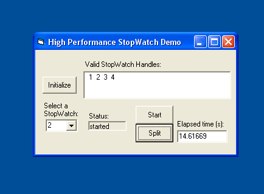



## High Performance StopWatch \[UPDATED\]

### Description

Very high resolution stopwatch, very low resources. Create as many stopwatches as you need with one module.
 
### More Info
 
Commented in code.

Commented in Code.

             |
---                |---
**Submitted On**   |2002-03-03 18:39:06
**By**             |[Code\-Breaker](https://github.com/Planet-Source-Code/PSCIndex/blob/master/ByAuthor/code-breaker.md)
**Level**          |Beginner
**User Rating**    |4.8 (19 globes from 4 users)
**Compatibility**  |VB 5\.0, VB 6\.0
**Category**       |[Windows API Call/ Explanation](https://github.com/Planet-Source-Code/PSCIndex/blob/master/ByCategory/windows-api-call-explanation__1-39.md)
**World**          |[Visual Basic](https://github.com/Planet-Source-Code/PSCIndex/blob/master/ByWorld/visual-basic.md)
**Archive File**   |[High\_Perfo59098332002\.zip](https://github.com/Planet-Source-Code/code-breaker-high-performance-stopwatch-updated__1-32304/archive/master.zip)

